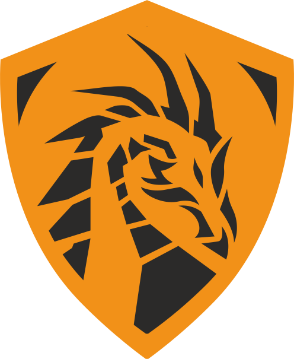

<h1 style="text-align: center">Правила и требования соревнований по информационной безопасности<nobr>Capture The Flag</nobr></h1>

 

---
<h2> Описание игры</h2>

Каждая команда имеет свой сервер, на сервере располагаются сервисы. 
Сервис — это работающее по сети приложение, которое запущено на хосте и которым могут пользоваться люди. Сервисы спроектированы так, что в них пользователь может оставлять какую-то приватную информацию, будь то его пароль, приватные заметки, видео <b>"только для друзей"</b> или данные платежной карты. 
 
Кроме того, сервисы спроектированы так, что каждый из них содержит одну или несколько уязвимостей, позволяющих эту приватную информацию похитить. 
  
Набор сервисов у каждой команды одинаковый, уязвимости тоже;  <b>если вы нашли уязвимость в своём сервисе, такая же уязвимость есть в этом сервисе у других команд!</b> 
  

<h3>Виртуальные пользователи</h3>
Раз в некоторое время ваш сервис используют виртуальные пользователи, созданные и направленные к вам организаторами соревнования. Эти пользователи пытаются использовать функционал вашего сервиса, в том числе оставляя там приватные данные. 
  
Эти данные — <b>это флаги</b>.
  
Они имеют общий формат, по которому их легко определить.
    
<b>Флаги</b> хранятся на вашем сервисе и должны быть доступны пользователю, который их оставил, но не должны быть доступны другим пользователям.  
Если приватные данные <b>(читай — флаги)</b> ваших пользователей будут похищены с вашего сервиса злоумышленниками из команд-соперниц — <b>вы будете терять очки</b>.
  
Виртуальных пользователи, помимо прочего, проверяют функциональность вашего сервиса; если это почта, то они могут: 
 
<b> 
1. Зарегистрироваться;     
2. Войти в почту;  
3. Отправить письмо;  
4. Прочитать пришедшие письма;  
5. Отметить письмо как спам (и больше не получать письма от этого собеседника).  
</b> 
Если ваш сервис функционирует неправильно или не доступен вообще, то вы будете терять баллы.  Ниже мы опишем это подробнее.  
<h3>Правила и подсчёт очков</h3> 
Каждая команда получает одинаковый набор сервисов.  
Раз в раунд (определенный временной интервал, обычно уточняемый организаторами, если их спросить напрямую) сервис команды проверяется организаторами с помощью чекера.   
<b>Чекер</b> — это программа, которая эмулирует работу реальных пользователей сервиса. В его задачи входит: проверить функционал сервиса, проверить в сервисе наличие флагов <b>(приватных данных)</b>, оставленных там ранее, положить в сервис новые флаги.
  
Флаг, который кладёт чекер, подчиняется общему правилу — это приватная информация в сервисе, которая является обычной строкой и подходит под регулярное выражение <b>[A-Z0-9]{31}=</b>   
После проверки сервиса чекером команда получает один из четырех статусов:  
<b>OK</b> — сервис функционирует нормально.  
<b>MUMBLE</b> — часть функционала сервиса не работает (например, вы отключили поиск по картинке в поисковике и пользователь не может им воспользоваться).  
<b>CORRUPT</b> — невозможно получить данные пользователя (например, пользователь отправлял письмо, но теперь не может его найти в исходящих из-за атаки другой команды).  
<b>DOWN</b> — сервис не доступен по сети.   
Для каждого сервиса считается один из самых важных результатов вашей команды в игре:  
<b>SLA</b> — количество прошедших игровых раундов, которые сервис провёл со статусом <b>OK / количество прошедших раундов вообще</b>.  
<b>Пример</b>: В игре прошло 20 раундов, команда получила 10 статусов OK, потом 2 статуса MUMBLE, 2 статуса CORRUPTED и 6 статусов ОК, тогда SLA по этому сервису будет равно (10 + 6) / 20 = 80%   
Следующий крайне важный параметр — это <b>FP (flag points)</b>.  
Обычно, ваши <b>FP</b> изначально равны нулю (или какой-то другой одинаковой для всех константе). Если вы похищаете приватные данные пользователей (флаги) с сервисов других команд, после чего направляете эти флаги в проверяющую систему жюри, ваши <b>FP</b> растут, а <b>FP</b> команды, чьи флаги вы похитили, падают. Обычно, чем больше <b>FP</b> было у команды соперников, тем больше <b>FP</b> вы получите.  
<h3>Подсчёт очков</h3> 
Расчет очков осуществляется по формуле <b>SLA * FP</b>.  
Например, если ваш сервис отработал на <b>ОК</b> в <b>80%</b> случаев, и вы набрали <b>1000</b> очков, то ваш счёт по этому сервису = <b>800</b>.  
Если в игре участвует не один сервис, а несколько (а чаще всего это именно так), то счет по всем сервисам суммируется.  
<h3>Игровая сеть</h3> 
В самом начале организаторы объявляют, как будет осуществляться доступ к игровым серверам.  
1. Вам будет выдан ключ для подключения к серверу VPN.  
2. Файлы-конфигурации посылаются заранее (примерно за полчаса до старта соревнований) капитану через Telegram.   
Популярные VPN-клиенты с легкостью справятся с конфиг-файлами, которые вам отправят, но на всякий случай рекомендуем использовать <b>tunnelblick</b> для <b>MacOS</b>, <b>Openvpn connect</b> для <b>Windows</b> и стандартный клиент <b>Openvpn</b> для <b>Linux</b>.   
3. <b>VPN-клиент</b> перенесет вас в игровую сеть, в которой вам необходимо подключиться к вашему серверу. Адрес сервера у каждой команды в зависимости от полученной вами в <b>VPN</b> подсети находится по адресу: <b>10.20.Х.5 (в случае изменений организаторы сообщат отдельно)</b>.  

<h3>Уязвимость</h3> 
Допустим, в исходном коде одного из сервисов вы нашли пароль от панели администратора. 
 Это значит, что у всех остальных команд пароль от панели администратора точно такой же.
  
<h3>Атака</h3> 
Для того чтобы атаковать вражескую команду, вам нужно знать её <b>IP-адрес</b>. В большинстве случаев организаторы выдают либо диапазон игровых <b>IP-адресов</b>, среди которых вы вольны выбрать в качестве жертвы любой, либо адреса видны напротив названий команд в <b>scoreboard'е</b>. 
  

<h3>Сдача флагов</h3> 
Если вы нашли флаг, вам необходимо сдать его в проверяющую систему и получить свои очки. 
Обычно проверяющая система располагается на сервере организаторов <b>(его IP выдаётся в начале игры)</b> и доступна по определенному порту <b>(который тоже уточняют в начале игры)</b>. 
Если не сказано иное, проверяющая система ожидает от вас подключения на указанный порт по протоколу <b>TCP</b> (например, с помощью утилиты netcat или socket в питоне), после чего вы должны представиться проверяющей системе, отослав свой <b>токен</b> (он выдается в начале игры), а затем вы должны послать похищенные у других команд флаги. 
За каждый похищенный флаг проверяющая система наградит вас очками <b>FP</b>, о чём и сообщит.  
Иногда проверяющая система откажет вам в очках по причине, в которой сразу и признается, это может быть:  
<b>"Flag is your own"</b> — флаг взят из вашего собственного сервиса  
<b>"Flag is too old"</b> — флаг был отправлен на сервис команды очень давно, и очки за него уже не дадут — ищите более свежие флаги. Обычно "время жизни" флага составляет от 2 до 10 раундов. Вы можете спросить организаторов про время жизни флага, они с радостью ответят. 
<b>"Wrong flag"</b> — флаг не существует. Вы могли опечататься, а может флаг был <b>"подделан"</b> командой, у которой вы его украли.  

<b>Кстати, один флаг может быть сдан вами только однажды — никаких бесконечных очков!
</b>
  
<h3>Дальнейшая игра</h3>
Вся дальнейшая игра заключается в том, чтобы <b>находить</b> новые <b>уязвимости</b>, которые еще не нашли остальные команды, <b>писать</b> автоматические <b>эксплоиты</b> и попытаться <b>набрать больше всех FP</b> в игре. 
Не забывайте защищаться от атак других команд — у вас не получится накопить много <b>FP</b>, если вас взламывают в ответ.  
Кроме того, будьте осторожны: некоторые уязвимости позволяют сделать ваш сервис недоступным, и вы можете начать терять <b>SLA</b>, что критически отразится на ценности ваших <b>FP</b>, ведь итоговый счёт — это произведение <b>SLA</b> на <b>FP</b>.
  
<h3>Глоссарий</h3> 
Если какие-то из терминов вам непонятны, то перечитайте страницу еще раз или напишите свой вопрос в чат.  
<b>Vulnbox</b> (игровая машина / уязвимый образ) — физическая / виртуальная машина, на которой находятся сервисы команды.  
<b>Сервис</b> — уязвимое приложение, работающее по сети, развёрнутое на <b>vulnbox'e.</b>   
<b>Раунд</b> — заданный временной промежуток, единица времени в игре.  
<b>Чекер</b> — программа, которую организаторы запускают каждый раунд для проверки работоспособности сервиса. Программа эмулирует действия пользователя в сервисе и оставляет флаги.  
<b>Атака</b> — успешное похищение флагов с сервиса команды-соперницы.  
<b>Защита</b> — устранение найденной уязвимости, после которого использовать её для атак становится невозможно.  
<b>Флаг</b> — строка, являющаяся частью приватных данных в сервисе. Обычно подходит под регулярное выражение <b>[A-Z0-9]{31}=</b>.  
<b>SLA</b> — доля прошедших игровых раундов со статусом <b>OK</b> для данного сервиса к общему количеству прошедших раундов. Обычно измеряется в процентах.  
<b>FP</b> (Flag Points) — численное значение, которое растет, когда вы крадете флаги и падает, когда их крадут у вас.  
 
<b>Эксплойт</b> — программа, которая автоматически занимается похищением флагов через найденную уязвимость.  
<b>Scoreboard</b> — приложение, отображающее текущее положение команд (турнирная таблица).

  
<h3>Краткая информация:</h3>
1. Всем стоит заранее ознакомиться со структурой<b> <a href="https://github.com/pomo-mondreganto/ForcAD">Scoreboard</a></b>  
2. Каждому участнику необходимо иметь при себе ноутбук для участия в соревновании. Выдать свои ноутбуки, к сожалению, не представляется возможным.  
3. У ноутбуков должен иметься разъем под кабель <b>Ethernet</b>, в случае его отсутствия просим заранее озадачиться покупкой переходника на USB разъем.<b>(<a href="https://www.dns-shop.ru/product/5b67b03ee96f3361/setevaa-karta-5bites-ua2-45-02bk/">пример</a>)</b> 
4. Розеток для подключения ноутбуков к питанию будет достаточно, в случае необходимости подключения в розетки чего-либо другого просим взять с собой 1 сетевой фильтр на команду.  
5. На столах будут стоять названия ваших команд, просьба проходить за столы вашей команды. 
   
<h3>Правила:</h3>
Есть только 4 ключевых пункта, применимых для соревнований:   
<b>
1. Нельзя атаковать системы организаторов.  
2. Нельзя фильтровать трафик от других команд.  
3. Нельзя генерировать чрезмерный объем трафика, способный навредить инфраструктуре.  
4. Нельзя ограждать свою инфраструктуру от других участников за счет WAF, IPS, Антивируса и других автоматизирванных систем защиты.
</b>

  
 
<b>В случае нарушения данных правил хотя бы одним членом команды, вся команда будет дисквалифицирована с соревнований.</b>

